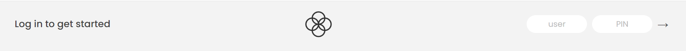
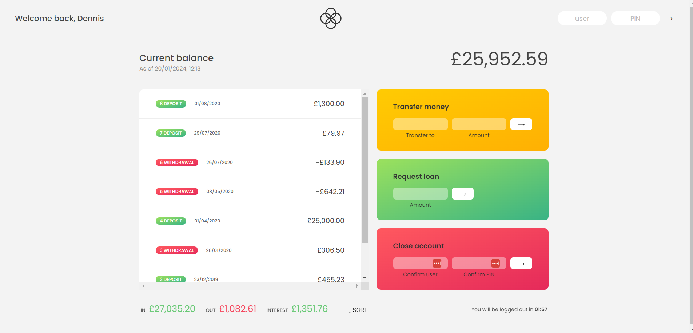

# Bank-app
Advanced Javascript Project - 

### user: Dr, PIN: 1111

### Login successful

### Uppon login

1. The timer starts counting down 2 minutes
2. A welcome message based on your name will pop up
3. Print the current date and time below the "Current balance" text

### Function in the app
1. When the transaction is made today it will print "Today", when more than 24 hours "Yesterday", when it 2 - 7 days "${dayPassed}days ago", otherwise it just prints the date in a format based on the location you are in
2. **Button Sort** - sort transactions from biggest number to lowest number.
3. Every transition made has its number (1 oldest - newest)

### Transactions
1. Every transaction which comes out from the account is red with the text "Withdrawal", add a minus symbol (-). 
2. Every transaction which comes into the account is green with the text "Deposit"
3. Request loan - cannot be bigger than 10%. Once submitted, it simulates 2,5 seconds delay before its printed on the page
4. Transfer money - send to userName Jd, only allows amount as big as your current balance. Once done it will subtract the money from your current balance and add money to a person you have sent it to.
   (you can check by logging in as Jesica Davis with username: jd, password: 2222)

### Close Account
1. It will delete the account if username and password matches with current account

### Calculations summary bottom page
1. **In** - It counts all deposits and is converted to two decimals
2. **Out** - It counts all withdrawals and is converted to two decimals
3. **Interest** - Different for each account holder. Is in %. for user dr it is 5%, for user jd it is 1.5% of the current balance

### Location settings
1. User dr is set to English, United Kingdom, Date (dd/mm/yyyy) currency (£), currency format (,), currency position (behind the number), is set to this country
2. User jd is set to English, United States, Date (mm/dd/yyyy), currency ($), currency format (.), (before the number), is set to this country

### Flowchart

